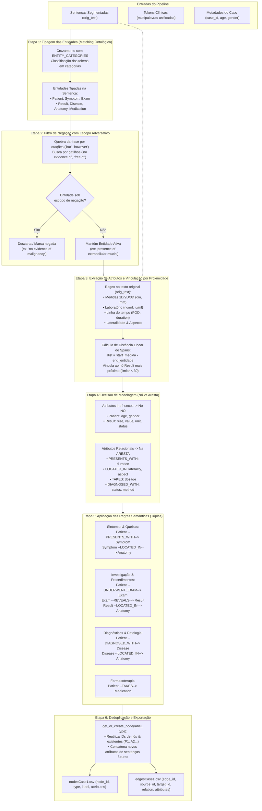
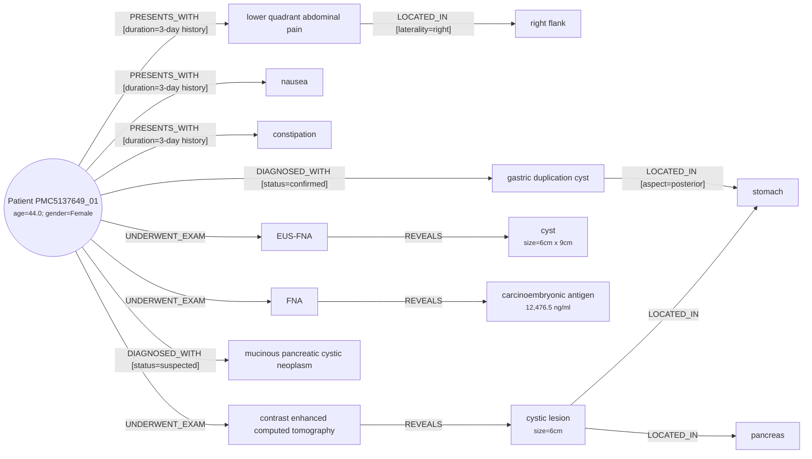

# Construção do Grafo de Conhecimento Clínico (Pipeline de Extração)

Este documento detalha a arquitetura e as 6 etapas determinísticas empregadas para converter o texto clínico livre dos relatos de caso em um Grafo de Conhecimento estruturado em nós e arestas com atributos ricos, pronto para consumo pelo visualizador D3/React e pelo Mermaid.

A implementação de referência deste pipeline pode ser consultada no notebook [`notebooks/complete_case_analysis.ipynb`](file:///home/raphael/Desktop/faculdade/MC896_NLP/Diplotokens-P1/project%201/notebooks/complete_case_analysis.ipynb) e nos módulos [`diplo_grafo/sentence.py`](file:///home/raphael/Desktop/faculdade/MC896_NLP/Diplotokens-P1/project%201/diplo_grafo/sentence.py) e [`diplo_grafo/clinical_terms.py`](file:///home/raphael/Desktop/faculdade/MC896_NLP/Diplotokens-P1/project%201/diplo_grafo/clinical_terms.py).

---

## O Ponto de Partida

Para cada sentença do relato clínico, o extrator recebe dois insumos já preparados pelas camadas anteriores do Diplotokens:

1. **O texto original completo (`orig_text`)**: Essencial para preservar pontuação, calcular spans absolutos e computar distâncias lineares de caracteres entre termos e medidas.
2. **A lista de tokens limpos e reconstruídos**: Onde termos multipalavras clínicos e siglas foram unificados em tokens únicos:
   ```python
   [
       "A", "44", "year-old", "woman", "presented", "with", "a", "3", "day",
       "history", "of", "right flank", "and", "lower quadrant abdominal pain",
       "associated", "with", "nausea", "and", "constipation", "."
   ]
   ```

A partir dessa estrutura, executamos **6 passos determinísticos** para montar o grafo.

---

## Diagrama do Pipeline de Construção (6 Etapas)



---

## As 6 Etapas Determinísticas

### 1. Tipagem das Entidades (Matching Ontológico)
Cruzamos os tokens da sentença contra um dicionário léxico estruturado (`ENTITY_CATEGORIES`), que classifica cada termo em uma das classes ontológicas do grafo:

* **`Patient`**: Criado na largada usando os dados estruturados do CSV (`case_id`, `age`, `gender`).
* **`Symptom`**: `lower quadrant abdominal pain`, `nausea`, `constipation`, etc.
* **`Exam`**: `contrast enhanced computed tomography`, `EUS-FNA`, `FNA`, etc.
* **`Result`**: `cystic lesion`, `pancreatic echotexture`, `carcinoembryonic antigen`, etc.
* **`Disease`**: `mucinous pancreatic cystic neoplasm`, `gastric duplication cyst`, etc.
* **`Anatomy`**: `right flank`, `stomach`, `pancreas`, `posterior wall`, etc.
* **`Medication`**: `chemotherapy`, `isoniazid`, `rifampin`, etc.

Se a sentença tem tokens pertencentes a essas classes, ela se torna candidata a gerar nós e arestas.

---

### 2. Filtro de Negação com Respeito a Orações Adversativas (`is_entity_negated`)
Antes de criar qualquer aresta, precisamos garantir que o médico não estava negando a condição:

* Buscamos gatilhos como: `no evidence of`, `negative for`, `free of`, `denies`, `without`, `uninvolved`.
* **Cuidado crucial com conjunções**: Se aplicássemos a negação na frase inteira, quebraríamos trechos como:
  > *"FNA of the cyst demonstrated **no evidence of malignancy** BUT did show the **presence of extracellular mucin**..."*
* **Solução**: O extrator fatia a sentença em orações separadas por `but`, `however` ou `although`. Assim, `malignancy` é descartada (ou marcada como negada), mas `extracellular mucin` continua ativa para o grafo!

---

### 3. Extração de Atributos por Regex e Vinculação por Proximidade
Os tokens nos dão os conceitos médicos, mas os números e qualificadores precisam ser amarrados a eles:

* **Dimensões (1D, 2D e 3D)**: `6cm`, `6cm x 9cm`, `9.5cm x 4.5cm x 2.0cm`.
* **Medições laboratoriais**: `12,476.5 ng/ml`, `6 iu/ml`.
* **Duração / Histórico**: `3-day history`.
* **Linha do tempo pós-operatória**: `POD 4` (*postoperative day 4*).
* **Lateralidade e Aspecto**: `right`, `left`, `posterior`, `anterior`.

#### Como associamos a medida ao nó correto?
Usamos **proximidade de caracteres (spans)** no texto original. Por exemplo, quando o regex encontra `6cm x 9cm`, calculamos a distância linear de caracteres entre o início da medida e o fim de todos os nós `Result` encontrados na mesma frase:

$$\text{distância} = \text{start\_medida} - \text{end\_entidade}$$

No texto:
> `"...revealed normal pancreatic echotexture and a cyst measuring 6cm x 9cm that was free..."`

* Distância de `6cm x 9cm` até `pancreatic echotexture`: **22 caracteres**.
* Distância de `6cm x 9cm` até `cyst`: **11 caracteres** (as letras de `" measuring "`).

O algoritmo seleciona o menor valor (11) e vincula a dimensão `size=6cm x 9cm` diretamente ao nó de `cyst`. Aplicamos um limiar de sanidade (`dist < 30`) para evitar associações indevidas a longa distância.

---

### 4. Decisão de Modelagem: O que vai no Nó vs O que vai na Aresta
Para manter o grafo limpo e semanticamente rico, separamos propriedades intrínsecas de modificadores relacionais:

| Onde colocar? | Tipo de Informação | Exemplos no nosso Grafo |
|---|---|---|
| **No NÓ (`attributes`)** | Propriedades intrínsecas da entidade que não dependem da relação. | • `Patient`: `age=44.0; gender=Female`<br>• `Result`: `size=6cm x 9cm`<br>• `Result`: `value=12,476.5; unit=ng/ml`<br>• `Result`: `status=normal` |
| **Na ARESTA (`attributes`)** | Modificadores do evento, tempo, dosagem ou certeza. | • `PRESENTS_WITH`: `duration=3-day history`<br>• `LOCATED_IN`: `laterality=right` ou `aspect=posterior`<br>• `TAKES`: `dosage=300 mg`<br>• `DIAGNOSED_WITH`: `status=confirmed; method=pathology` |

---

### 5. Aplicação das Regras Semânticas de Relação (Geração das Triplas)
Dentro do escopo de cada sentença ativa, disparadores sintático-semânticos ligam as entidades:

#### A. Apresentação Clínica (`Patient --PRESENTS_WITH--> Symptom`)
* **Gatilho**: Presença de `Symptom` associada a verbos como *presented with*, *complained of*, *history of*, *pain*.
* **Ação**:
  * Cria aresta `Patient --PRESENTS_WITH [duration=3-day history]--> Symptom`.
  * Se for dor e houver anatomia na frase: liga `Symptom --LOCATED_IN [laterality=right]--> Anatomy`.

#### B. Investigação por Imagem e Procedimentos (`Patient --UNDERWENT_EXAM--> Exam`)
* **Gatilho**: Presença de `Exam` (*computed tomography*, *EUS-FNA*, *endoscopy*).
* **Ação**:
  * Cria `Patient --UNDERWENT_EXAM [timeline]--> Exam`.
  * Todos os `Result` daquela sentença são ligados via `Exam --REVEALS--> Result` (já com suas dimensões e valores laboratoriais embutidos no nó de resultado).
  * Liga os achados à anatomia descrita: `Result --LOCATED_IN [aspect]--> Anatomy`.

#### C. Diagnóstico e Histórico Patológico (`Patient --DIAGNOSED_WITH--> Disease`)
* **Gatilho**: Presença de `Disease` (*mucinous pancreatic cystic neoplasm*, *GDC*).
* **Ação**:
  * Se o contexto indicar histórico prévio (*past medical history*), cria `HAS_PERSONAL_HISTORY` ou `HAS_FAMILY_HISTORY`.
  * Se for diagnóstico da internação: cria `DIAGNOSED_WITH`.
  * **Inferência de certeza**:
    * Se na frase tem *pathology* ou *consistent with*: anota na aresta `status=confirmed; method=pathology`.
    * Se tem *suggesting* ou *suspected*: anota `status=suspected; method=clinical/imaging`.
  * Conecta a doença ao órgão afetado: `Disease --LOCATED_IN--> Anatomy`.

---

### 6. Deduplicação e Exportação dos CSVs
Para evitar que o nó `stomach` ou o exame `CT` sejam duplicados a cada frase em que aparecem:

1. Mantemos um registro central via `get_or_create_node(label, type)`.
2. Se o nó já existe, reutilizamos seu `node_id` (ex: `A2`). Se uma sentença futura trouxer um detalhe novo (ex: um `status=normal`), o atributo é concatenado no nó existente.
3. Por fim, geramos os DataFrames e salvamos em:
   * [`data/processed/nodesCase1.csv`](file:///home/raphael/Desktop/faculdade/MC896_NLP/Diplotokens-P1/project%201/data/processed/nodesCase1.csv)
   * [`data/processed/edgesCase1.csv`](file:///home/raphael/Desktop/faculdade/MC896_NLP/Diplotokens-P1/project%201/data/processed/edgesCase1.csv)

---

## Visualização do Grafo Gerado (Exemplo: Caso 1)

O processamento completo do relato do Caso 1 (`PMC5137649_01`) resulta no seguinte Grafo de Conhecimento:


