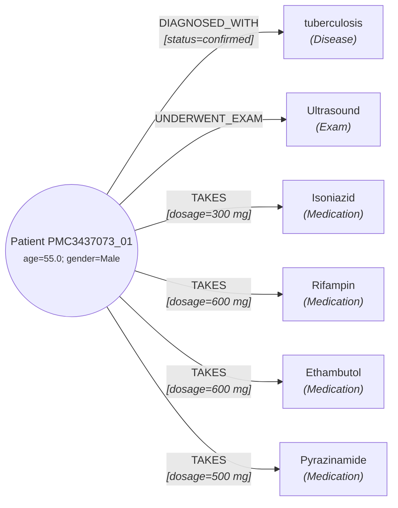

# Análise de Gargalos e Limitações da Modelagem do Grafo Clínico

Este documento registra os gargalos e limitações identificados na modelagem clássica de Grafos de Conhecimento clínico baseada em regras e expressões regulares, tomando como estudo de caso empírico o **Caso 2 (`PMC3437073_01`)** do dataset de amostra (`data/raw/sample/cases.csv`), conforme implementado e executado no notebook [`notebooks/gargalo_caso_2.ipynb`](../notebooks/gargalo_caso_2.ipynb).

---

## 1. Contexto do Caso 2 (`PMC3437073_01`)

O Caso 2 descreve um paciente do sexo masculino de 55 anos que se apresentou com uma massa no tórax e abdômen de crescimento progressivo ao longo de 1 ano. Durante a investigação, descobriu-se um abscesso esplênico tuberculoso complicado comunicando-se por uma fístula transdiafragmática com um abscesso subcutâneo da parede torácica, além de uma cicatriz calcificada pulmonar de tuberculose antiga. O paciente foi submetido a cirurgia (esplenectomia + drenagem) e recebeu terapia antituberculosa combinada com 4 fármacos durante 5 semanas (fase intensiva), sendo posteriormente mantido com apenas 2 fármacos (fase de consolidação).

---

## 2. O Grafo Gerado pelo Pipeline Atual

Ao aplicarmos o pipeline de extração sobre as 18 sentenças do Caso 2, o seguinte grafo de nós e arestas foi gerado:

### Tabelas Exportadas:
* **Nós ([`nodesCase2.csv`](../data/processed/nodesCase2.csv)):** Contém apenas `P1` (Paciente), `D1` (Tuberculosis), `E1` (Ultrasound) e os 4 medicamentos (`M1-M4`).
* **Arestas ([`edgesCase2.csv`](../data/processed/edgesCase2.csv)):** Contém a aresta de diagnóstico precoce, a realização do exame e as 4 arestas de `TAKES` com suas dosagens.

---

## 3. Matriz Sintética dos 6 Gargalos Identificados

| # | Gargalo Clínico / NLP | O que o texto clínico relata | O que o Grafo gerou | Impacto / Limitação Estrutural |
|---|---|---|---|---|
| **1** | **Falso Positivo por Negação de Contato** | Sentença 1: *"He had no other medical problems and **no history of contact with a tuberculous patient**."* | `P1 -- DIAGNOSED_WITH [status=confirmed] --> tuberculosis` | A regra de casamento léxico encontra a raiz *tuberculous* e diagnostica a doença na 1ª sentença, ignorando que se tratava de negação de exposição epidemiológica interpessoal. |
| **2** | **Colapso Temporal da Farmacoterapia** | Sentença 16: *"started on Isoniazid 300 mg, Rifampin 600 mg, Ethambutol 600 mg and Pyrazinamide 500 mg for 5 weeks, **then maintained on the former two drugs**."* | 4 arestas estáticas idênticas `TAKES (dosage=...)` | O grafo estático não possui dimensão temporal. Faz parecer polifarmácia permanente, apagando a suspensão de Etambutol/Pirazinamida após 5 semanas (fase de ataque vs manutenção). |
| **3** | **Cicatriz Inativa vs Complicação Aguda** | Sentença 5: *"calcified lesion near the hilum suggestive of an **old pulmonary tuberculosis**"* vs Sentença 9: *"complicated **tuberculous splenic abscess**"*. | Nó único `tuberculosis` conectado ao paciente | O modelo colapsa uma infecção pulmonar curada do passado com a patologia aguda extrapulmonar responsável pela internação atual. |
| **4** | **Topologia Espacial Inter-Lesão (Fístula)** | Sentenças 8 e 12: *"splenic abscess **communicating with another subcutaneous abscess** through a small tract in the lower chest wall"*. | Apenas conexões isoladas `Result -- LOCATED_IN --> Anatomy` | Incapacidade de modelar relações físicas entre duas lesões (`Result -- COMMUNICATES_WITH --> Result`). O trajeto fistuloso transdiafragmático é perdido. |
| **5** | **Perda da Queixa Principal (Rigidez Léxica)** | Sentença 0: *"presented with a gradually increasing **mass** on the left lateral lower chest and upper abdomen over a period of **one year**"*. | **Zero sintomas** extraídos (`PRESENTS_WITH` vazio) | O vocabulário fechado não classificou *"mass"* como sintoma de apresentação, omitindo a queixa que motivou a busca por atendimento. |
| **6** | **Resultados Negativos vs Confirmação Histológica** | Sentença 15: *"bacterial cultures were **all negative**"* vs Sentença 14: biópsia com *"caseation necrosis"*. | Exclusão das culturas ou conflito de status | Dificuldade da modelagem binária clássica em expressar que bacteriologia negativa não invalida a confirmação histopatológica. |

---

## 4. Detalhamento Aprofundado de Cada Gargalo

### Gargalo 1: Falso Positivo por Negação de Contato Epidemiológico
* **Origem:** O extrator sentencial verifica a presença de termos da categoria `Disease` em cada frase.
* **Mecanismo da Falha:** A frase *"no history of contact with a tuberculous patient"* contém a palavra *"tuberculous"*, que é capturada como a doença *tuberculosis*. O filtro de negação padrão busca padrões como *"no evidence of [disease]"* ou *"denies [disease]"*. No entanto, aqui a negação se aplica ao **contato interpessoal** (*"contact with a ... patient"*), e não ao estado patológico do paciente em si.
* **Consequência:** Diagnóstico prematuro e falso-positivo gerado na primeira sentença da narrativa.

---

### Gargalo 2: Colapso da Linha Temporal Farmacoterapêutica
* **Origem:** Na medicina, o tratamento antituberculoso clássico (RIPE) divide-se em:
  1. **Fase Intensiva / Ataque (2 meses / 5 semanas no relato):** 4 drogas (Rifampicina, Isoniazida, Pirazinamida, Etambutol) para rápida redução bacteriana.
  2. **Fase de Manutenção / Consolidação:** 2 drogas (Rifampicina e Isoniazida) para esterilização tecidual.
* **Mecanismo da Falha:** Em um Grafo de Conhecimento estático de triplas `(Sujeito, Predicado, Objeto)`, todas as arestas coexistem no mesmo plano temporal. A aresta `P1 -- TAKES (dosage=500 mg) --> Pyrazinamide` não possui anotação de término de vigência.
* **Consequência:** Para sistemas de apoio à decisão ou interação medicamentosa, o paciente aparenta estar em uso crônico contínuo de 4 drogas hepatotóxicas, o que constitui um erro médico de representação.

---

### Gargalo 3: Confusão entre Infecção Passada Inativa e Complicação Aguda Presente
* **Origem:** O paciente apresenta dois fenômenos relacionados à mesma etiologia microbiológica (*Mycobacterium tuberculosis*):
  1. Uma lesão calcificada pulmonar antiga cicatrizada (*"old pulmonary tuberculosis"*), assintomática;
  2. Um abscesso esplênico liquefeito agudo e volumoso com necrose de caseificação.
* **Mecanismo da Falha:** A ontologia unifica conceitos pelo lema canônico `tuberculosis`. O grafo não distingue a fase (ativo vs sequela/inativo) nem o foco (pulmonar vs extrapulmonar).
* **Consequência:** O modelo unifica sob o mesmo nó entidades clínicas com prognósticos, condutas e significados completamente opostos.

---

### Gargalo 4: Topologia Espacial e Conexão Inter-Lesão (Fístula)
* **Origem:** O exame de Tomografia Computadorizada (CT) e o achado intraoperatório descrevem uma **fístula anatômica**:
  * O abscesso originou-se no baço (cavidade abdominal superior esquerda).
  * Devido à inflamação e adesão ao diafragma e à parede torácica inferior, formou-se um trajeto fistuloso transdiafragmático conectando a cavidade esplênica ao tecido subcutâneo torácico.
* **Mecanismo da Falha:** A ontologia proposta em `steps.md` assume relações estritamente bipartidas do tipo `Achado -- LOCATED_IN --> EstruturaAnatomica`. Não existem arestas de interconexão entre achados (`Result -- COMMUNICATES_WITH --> Result` ou `PATHOLOGICAL_TRACT`).
* **Consequência:** A fisiopatologia central do relato (que explica por que uma doença do baço gerou uma massa palpável no tórax) fica completamente invisível no grafo.

---

### Gargalo 5: Rigidez Lexical e Perda da Queixa Principal
* **Origem:** O paciente procurou o serviço de saúde devido a *"a gradually increasing mass on the left lateral lower chest and upper abdomen over a period of one year"*.
* **Mecanismo da Falha:** A palavra *"mass"* (massa/tumor palpável) foi classificada no vocabulário como achado observacional (`Result`) e não como motivo de consulta (`Symptom`). Como a regra de `PRESENTS_WITH` exige entidades da categoria `Symptom`, nenhuma aresta de apresentação foi instanciada.
* **Consequência:** O paciente fica sem queixa inicial registrada no grafo, quebrando a história da moléstia atual (HMA).

---

### Gargalo 6: Conflito entre Culturas Negativas e Histopatologia Positiva
* **Origem:** A bacteriologia direta (*Acid-fast bacilli staining*) e as culturas microbiológicas foram negativas (*"were all negative"*). Entretanto, a biópsia excisional da peça cirúrgica revelou granuloma tuberculóide típico com necrose caseosa e células gigantes de Langhans.
* **Mecanismo da Falha:** Em tuberculose extrapulmonar paucibacilar, é frequente que culturas sejam negativas enquanto a histopatologia é conclusiva. Em modelos de regras estritas, filtros de negação frequentemente eliminam a suspeita diagnóstica ao detectar *"cultures negative"*, ou, inversamente, ignoram que o exame microbiológico resultou negativo.
* **Consequência:** O grafo não tem como expressar evidência diagnóstica divergente entre exames microbiológicos e anatomopatológicos.

---

## 5. Recomendações e Diretrizes para Trabalhos Futuros (P2)

1. **Modelagem Temporal Explícita (4D Knowledge Graphs):**
   * Incorporar atributos de intervalo temporal nas arestas (ex: `valid_from`, `valid_to`, `clinical_phase: intensive | maintenance`).
2. **Análise de Dependência Sintática (Dependency Parsing):**
   * Substituir janelas de regex planas por grafos sintáticos (ex: via spaCy/Stanza) para verificar o regente do termo: em *"contact with a tuberculous patient"*, o termo *"tuberculous"* modifica *"patient"*, cujo regente é *"contact"*, sob escopo de *"no history of"*.
3. **Ontologias Relacionais Mais Ricas:**
   * Permitir arestas de ordem superior (hipergrafos ou relações lesão-lesão) como `COMMUNICATES_WITH`, `COMPLICATION_OF`, `PREVIOUS_INACTIVE`.
