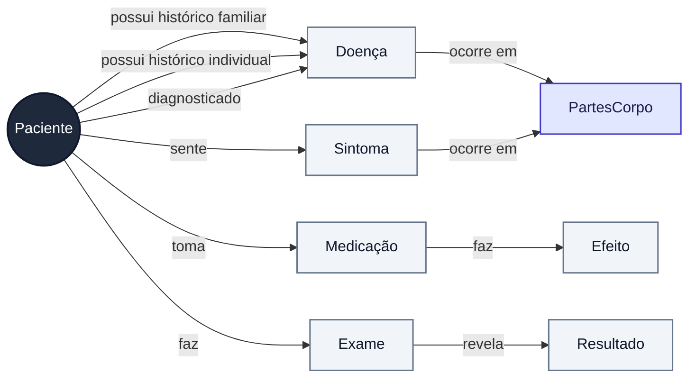

# passo a passo poggers

1 - separar em frase  
2 - tokenizar?  
3 - lematizar usando LVG
4 - lidar com frases de perguntas  
5 - lidar com frases com negação  
6 - fazer as relações de entidades.

---
## Passo a Passo poggerers (mais poggers)

1. Para cada case:

    2. Estruturar das informações básicas do csv
        - ID, age, gender..

    3. Usar regex sep para organizar o texto em uma lista de sentenças. Uma sentença pode ter um marcador de "has interrogation".

    4. Para cada sentença:

        - - Não sei se a lematização entra antes ou depois da tokenização

        5. Tokenização: organizar cada sentença em uma lista de tokens

        6. Classificação:
            - Para cada token:
                - Checar se é um termo classificável como: doença, quantidade. Já dá pra "marcar" aqui se o token representa uma DENOTAÇÃO (diagnosticar, ter histórico, realizar procedimento etc)
                - Descartar tokens inúteis?
        
        7. Identificar e marcar se a sentença é "duvidosa" (contém negação, pergunta, possibilidade tipo "could have"...). Para uma primeira versão podemos simplesmente descartar e anular essas sentenças. Para sentenças com interrogação, pode haver uma lógica para anular apenas a última denotação.

    8. Para cada sentença válida:

        9. Transformar em arestas ligando nós:

            - Exemplo: se há um token "diagnosticar" e 3 doenças, serão criadas arestas "diagnosticado -> doenças".

            - Tem ter um script para resolver sentenças com mais de um verbo/ação que ligue um mesmo tipo de nó, tipo se houver "diagnosticar" e "histórico" na mesma frase com n doenças, o algoritmo tem que decidir quais doenças vão pra cada aresta.

