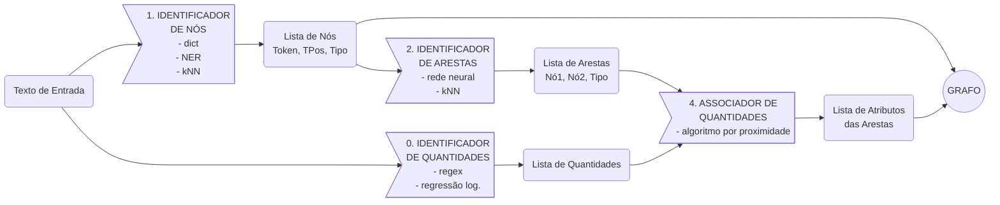
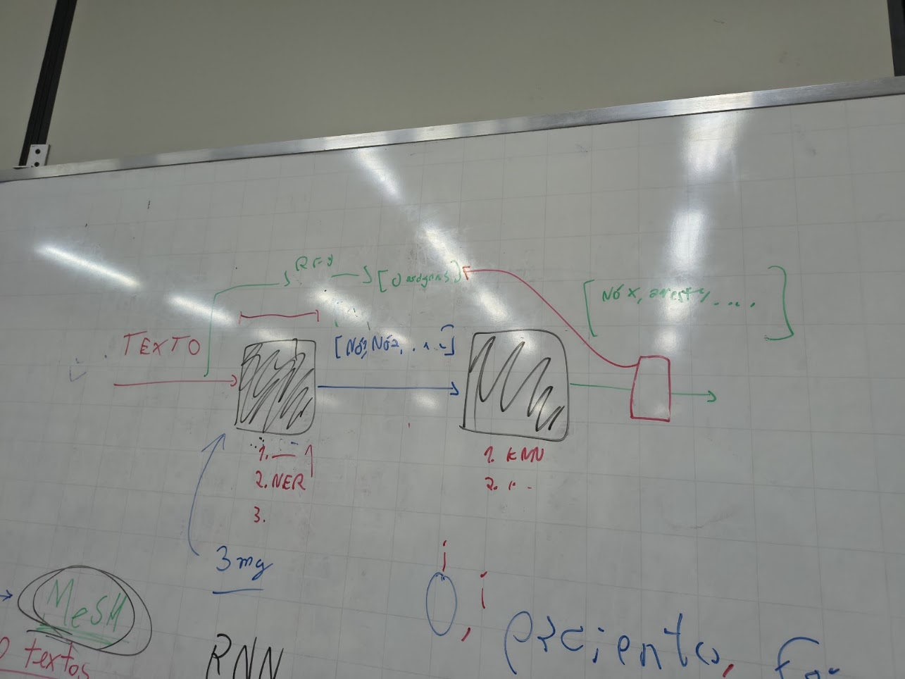

## Pipeline de processamento:

```mermaid
flowchart LR;

    T(Texto de Entrada)
    N>1. IDENTIFICADOR\n DE NÓS\n- dict\n- NER\n- kNN]
    LN(Lista de Nós\nToken, TPos, Tipo)
    E>2. IDENTIFICADOR\n DE ARESTAS\n- rede neural\n- kNN]
    LE(Lista de Arestas\nNó1, Nó2, Tipo)
    Q>0. IDENTIFICADOR\n DE QUANTIDADES\n- regex\n- regressão log.]
    QA>4. ASSOCIADOR DE\n QUANTIDADES\n- algoritmo por proximidade]
    LQ(Lista de Quantidades)
    LT(Lista de Atributos\n das Arestas)
    G((GRAFO))

    T --> N
    N --> LN
    LN --> E
    E --> LE
    LE --> QA

    T --> Q
    Q --> LQ
    LQ --> QA

    QA --> LT

    LN --> G
    LT --> G
    
```

Esboço do esquema feito na lousa:

